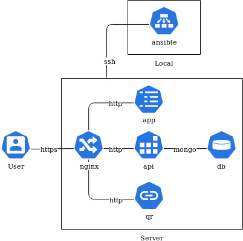

# Hosting

In diesem Dokument werden die Anforderungen an den Server zum Betrieb der LabTrail Applikation festgehalten.

## Container

Die Dienste der LabTrail Applikation werden als Docker Container erstellt und publiziert.

Auf dem Docker Host werden die folgenden 5 Container ausgeführt:

**labtrail/app**

Beschreibung: Client Applikation  
Docker Image: node:12-alpine  

**labtrail/api**

Beschreibung: Datenschnittstelle  
Docker Image: node:12-alpine  

**labtrail/qr**

Beschreibung: QR-Code Redirect  
Docker Image: node:12-alpine  

**labtrail/proxy**

Beschreibung: Proxy für Dienste  
Docker Image: owasp/modsecurity:3-nginx

**labtrail/database**

Beschreibung: Datenbank  
Docker Image: mongo:4.2.2  
Volume: `/usr/share/labtrail/database`

Dazu eine schematische Darstellung wie die Container miteinander verknüpft werden:

## Verbindungen

Damit die Applikation von aussen erreichbar ist und vom Anbieter installiert werden kann, müssen die folgenden Verbindungen erlaubt sein:

* HTTPS: Port 443 für Zugriff via Browser
* SSH: Port 22 oder anderer

### Domain

Die Applikation ist unter [https://labtrail.app](https://labtrail.app) erreichbar. Zur Sicherung der Verbindung werden SSL-Zertifikate benötigt. Falls diese nicht vom Hoster bereitgestellt werden, muss zusätzlich die folgende Verbindung von aussen möglich sein.

* HTTP: Port 80 für [Let's Encrypt ACME challenge](https://letsencrypt.org/docs/allow-port-80/)

Die SSL-Zertifikate werden bei Bedarf mit Let's Encrypt erstellt.

## Deployment

Die Installation von Docker und den Container erfolgt mit [Docker Compose](https://docs.docker.com/compose/). Als Teil der Projektumsetzung wird eine Docker Compose Konfiguration bereitgestellt. Die Datei enthält Anweisungen zur Server-Konfiguration und Bereitstellung der LabTrail Applikation.

### Key Management

Schlüssel, Geheimnisse und Zertifikate werden lokal in einer `.env`-Datei gespeichert.

## Anforderungen

Der Server muss die folgenden Anforderungen zum Betrieb der LabTrail Applikation erfüllen:

* [Docker Support](https://docs.docker.com/install/linux/docker-ce/ubuntu/) vorhanden
* Installation von Software-Paketen mit [Aptitude](https://help.ubuntu.com/lts/serverguide/aptitude.html) oder [Snap](https://snapcraft.io/) möglich
* Root-Zugriff (sudo) erlaubt
* SSH-Zugriff mit Public Key erlaubt
* Ausgehende Verbindungen erlaubt
  * [Docker Hub](https://hub.docker.com/)
  * [Sentry](https://sentry.io)
  * [GitHub](https://github.com/)
* Diskspace mindestens 10 GB (mit OS) vorhanden
* Persistierung von Dateien unter `/usr/share` erlaubt
* Server unter DNS Name `labtrail.app` erreichbar